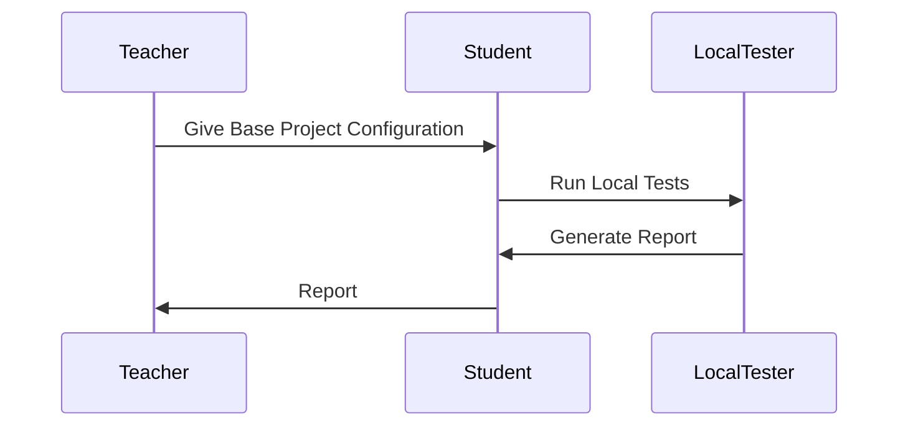
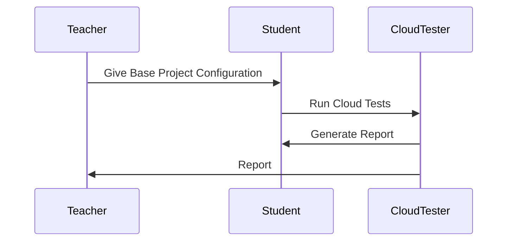
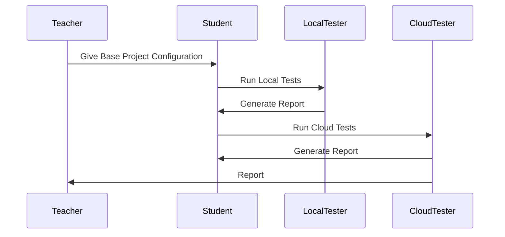

<!-- This page contains only the concept description. -->

# EduTe
> edute

## Description

**EduTe** is an open-source project that provides a simple and 
easy-to-use testing framework for educational projects. It is designed to
be used in educational environments where students need to test their
projects against a set of predefined test cases. 

This framework is designed, first and foremost, to simplify the testing process 
in local environments. It provides a simple way to define test cases and
build/run them against the student's project. It also provides a way to 
automatically generate a report with the results of the tests and give brief
grades to the students.  
It can also be used in continuous integration environments, where the tests
can be run automatically every time a new commit is pushed to the repository.  
Non-core features include the ability to run the tests in cloud environments
that have implemented the API defined by **EduTe**.

The framework is designed to be language-agnostic, meaning that it can be used
to test projects written in any programming language. The only requirement is
that the project can be built and run from the command line.

## Features

### Local tester CLI app:
<!-- 
Add issues for each feature requirement
 -->
- [ ] Define project file specification
    - [ ] Project name
    - [ ] Build strategy
    - [ ] Run strategy
    - [ ] Test cases
        - [ ] Simple I/O test case
            - [ ] Test simple `C`, `Python`, `Java` CLI app
                - Note: as a reference, use [local `turing.sk` tester](
                    https://github.com/ic-it/local-turing
                )
                - Create tests for [PKS course, assignment 1](
                    https://github.com/fiit-ba/pks-course/tree/4abe084057caf84f12264335b2ed25f7fb6e4225/202324/assignments/1_network_communication_analyzer
                )
            - [ ] Test `SQL` queries
        - [ ] I/O with hidden output
            - Proposal: Use hashing for correct outputs
        - [ ] Tests stateful applications:
            - [ ] Test [PKS course, assignment 2](https://github.com/fiit-ba/pks-course/tree/4abe084057caf84f12264335b2ed25f7fb6e4225/202324/assignments/2_communication_over_udp)
        - [ ] Give each test case a name, description, and points
    - [ ] Cloud
        - [ ] Address
        - [ ] Credentials
        - [ ] API strategy
- [ ] Run local tests
    - [ ] Build project
    - [ ] Run test cases
- [ ] Generate report
    - [ ] Markdown
    - [ ] Typst
    - [ ] PDF
- [ ] Grade students
    - [ ] Tentative grades
        - Note: Just a simple sum of points
    - [ ] Export grades
        - [ ] CSV
        - [ ] JSON
- [ ] Run tests in cloud environments
    - [ ] Define cloud environment API
        - [ ] REST API
        - [ ] Web socket API
        - [ ] Protobuf 
            - Note: Most likely, we will use gRPC
    - [ ] Implement API client
        - [ ] REST API client
        - [ ] Websocket API client
        - [ ] Protobuf client 
    - [ ] Pull public tests
    - [ ] Run tests in the cloud
        - [ ] Run tests in the cloud
        - [ ] Get results

### VS Code extension:

- [ ] Identify project file
- [ ] Run tests
- [ ] Generate report
- [ ] Grade students
- [ ] Run tests in cloud environments

### Github Action:

- [ ] Identify project file
- [ ] Run tests
- [ ] Generate report
- [ ] Grade students
- [ ] Run tests in cloud environments

### Cloud environment example:

**Just an example, it should be implemented in the future**

## Diagrams

### Cloud/Local Tester Sequence Diagram

#### Local Tester

> Note: The Local Tester can be run from the command line or as a VS Code extension.  
> If subject has no cloud tester, student can run local tests and generate a report.

#### Cloud Tester

> Note: The Cloud Tester can be run from the command line or as a VS Code extension.

#### Local Tester with Cloud

